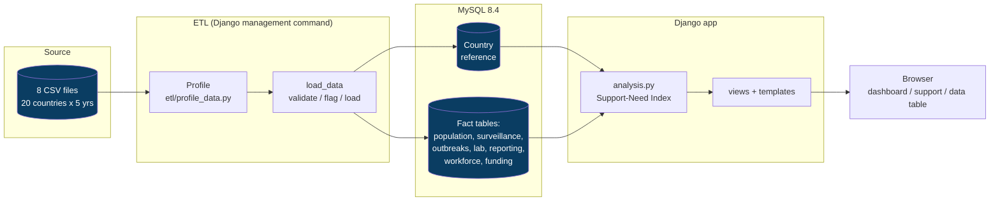
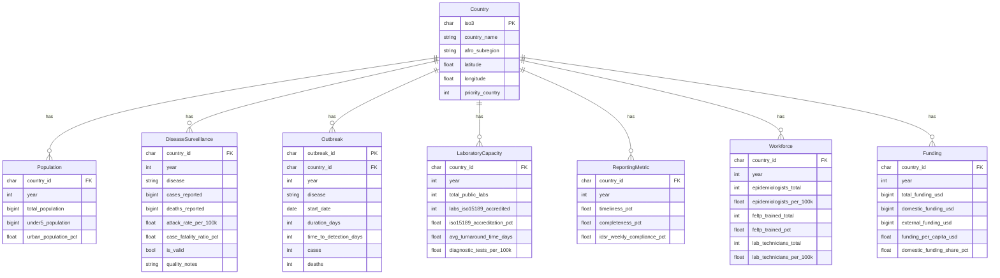

# Architecture

## System overview

All of this runs as two Docker Compose services: `db` (MySQL) and `web` (Django).
The `web` container waits for the database, migrates, runs the ETL, then serves the app.

## Data model (schema)

`Country` is the single reference (dimension) table; every other table is a fact
table on a `(country, year)` key — a star-style layout that matches the panel shape
of the source data. Each fact table has a unique constraint on its key, and the
columns most used for filtering (`year`, `disease`, `afro_subregion`,
`priority_country`, `is_valid`) are indexed.
